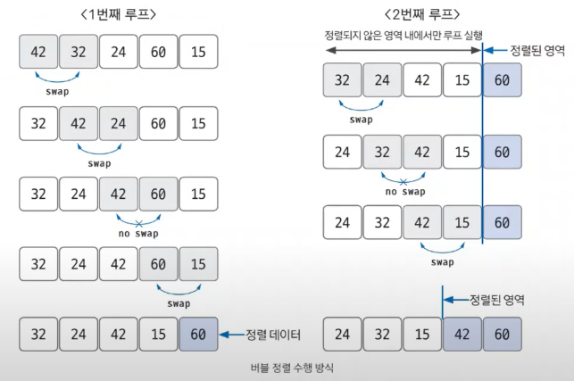

# 버블 정렬

> 정렬 알고리즘 비교

## 버블 정렬 핵심 이론
- 인접한 데이터의 크기를 비교해 정렬
- 시간 복잡도 O(n^2), 비교적 **느린 편**

## 수행 방식
1. 비교 연산이 필요한 루프 범위를 설정
2. 인접한 데이터 값 비교 (처음부터 끝까지, 2개씩 비교)
3. swap 조건에 부합하면 (큰 수가 왼쪽에 있다면) swap 연산 수행
4. 루프 범위 끝날때 까지 2~3 반복
5. 제일 끝에 숫자 고정 후 나머지 영역 1~4 실행
6. 비교 대상 없을 때 가지 1~5 반복
7. *참고 - 만약 특정 루프에서 swap이 한 번도 없었으면, 데이터가 모두 정렬되었다는 뜻이므로 프로세스 종료해도 됨*
