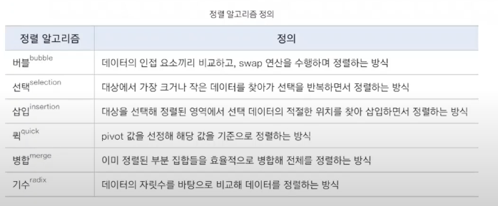
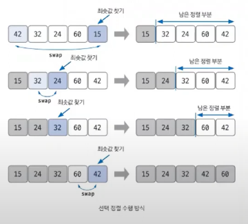

# 선택 정렬

> 정렬 알고리즘 비교

## 선택 정렬 핵심 이론
- 알고리즘 자체는 간단
- 시간 복잡도 O(n^2), 비교적 **느린 편**
- 코딩테스트에서는 많이 사용하지 않음! - N이 100~1000정도일때만 적합
- 최솟값 또는 최댓값 찾고, 남은 정렬 부분의 가장 앞 데이터와 swap

## 수행 방식
1. 남은 정렬 부분에서 최솟값 또는 최댓값 찾는다
2. 남은 정렬 부분에서 가장 앞 데이터와 선택 데이터 swap
3. 가장 앞 데이터 위치를 변경에 남은 정렬 부분 범위 축소
4. 전체 데이터 크기만큼 Index 커질 때 까지, 즉 남은 정렬 부분이 없을 때 까지 반복
