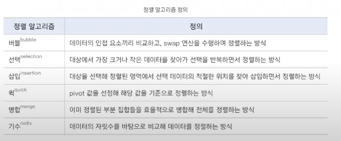
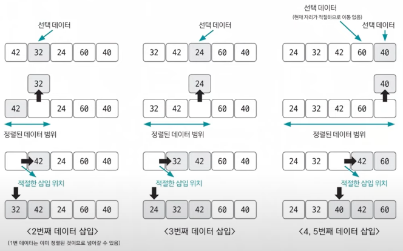

# 삽입 정렬

> 정렬 알고리즘 비교

## 삽입 정렬 핵심 이론
- 이미 정렬된 데이터 범위에 정렬되지 않은 데이터를 적절한 위치에 삽입시켜 정렬하는 방식
- 시간 복잡도 O(n^2), 비교적 **느린 편**

## 수행 방식
1. 현재 index에 있는 데이터 값을 선택한다.
2. 현재 선택한 데이터가 정렬된 데이터 범위에 삽입될 위치를 탐색한다.
3. 삽입 위치부터 index에 있는 위치가지 shift 연산을 수행한다.
4. 삽입 위치에 현재 선택한 데이터를 삽입하고 index++연산을 수행한다.
5. 전체 데이터의 크기만큼 index가 커질 때까지, 즉 선택할 데이터가 없을 때 까지 반복한다.
6. *참고 - 적절한 삽입 위치를 탐색하는 부분에서 이진 탐색 등과 같은 탐색 알고리즘을 사용하면 시간 복잡도를 줄일 수 있음*
