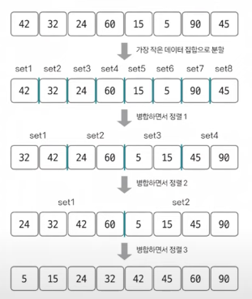
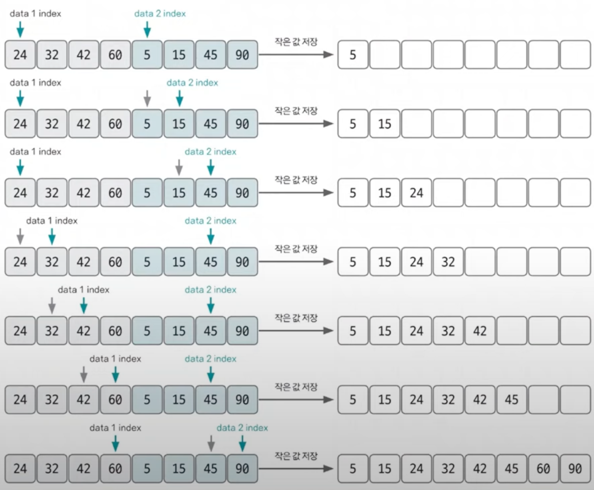

# 병합 정렬 ⭐️

> 정렬 알고리즘 비교

## 병합 정렬 핵심 이론
- 시간 복잡도 O(nlogn), 비교적 **빠른 편**
- 데이터를 분할하고 분할한 집합을 정렬하며 합치는 알고리즘
- 분할 정복 방식
- 작은 그룹으로 나눈 후, 두 그룹을 하나의 그룹으로 (-> logn) 합쳐가며 정렬

## 2개의 그룹을 병합하는 과정
- 투 포인터 개념 사용해 왼쪽, 오른쪽 그룹을 병합
- 왼쪽 포인터와 오른쪽 포인터의 값을 비교하여 작은 값을 결과 배열에 추가하고 포인터를 오른쪽으로 1칸 이동시킴
- 이 방식은 여러 문제에서 응용하므로 반드시 숙지!!
