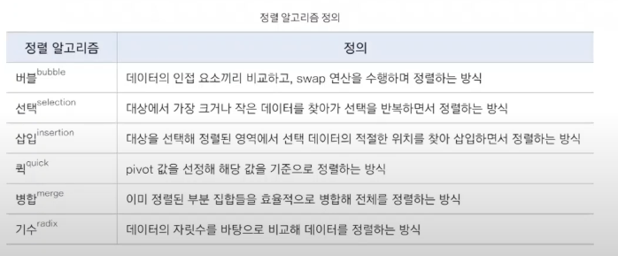
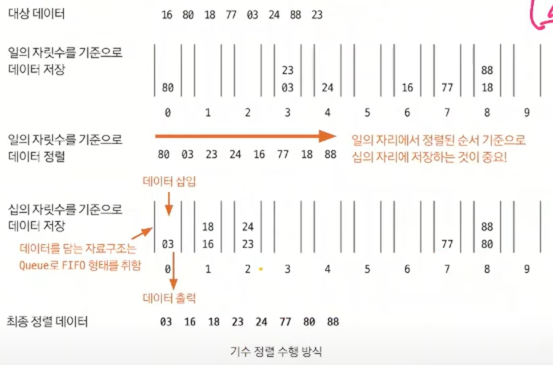

# 기수 정렬

> 정렬 알고리즘 비교

## 기수 정렬 핵심 이론
- 알고르즘 정렬에서 주류는 아님, 어려운 문제의 경우 사용해야 할 때가 있음.
- 값을 비교하지 않는 특이한 정렬
- 값을 놓고 비교할 자릿수를 정한 다음 해당 자릿수만 비교
- 시간 복잡도 O(kn), k는 데이터의 자릿수 (N이 가능한 최대 자릿수)
- 시간 복잡도가 가장 짧은 정렬!
- 이론은 쉽지만 코드로 구현하는 것이 조금 까다로움.

## 수행 방식
- 10개의 큐를 이용 (0~9), 각 큐는 값의 자릿수를 대표
