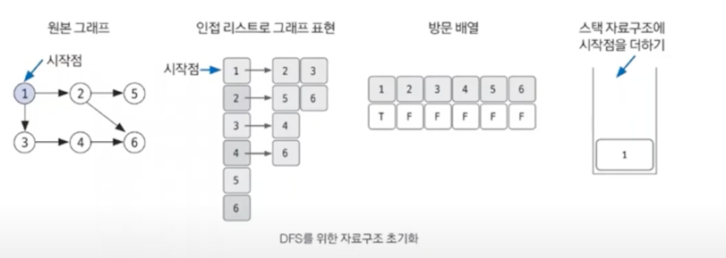
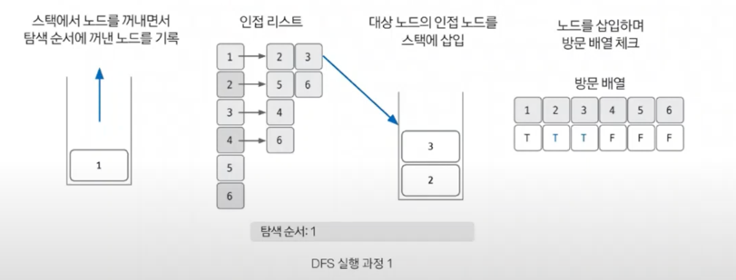
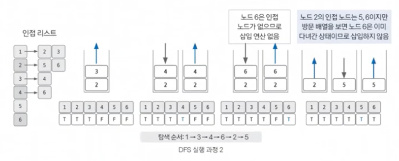

# DFS (깊이우선탐색)

## 깊이 우선 탐색 핵심 개념
- 그래프 완전 탐색 기법 중 하나 (완전탐색 = 모든 노드 조회)
- 시작 노드에서 출발, 분기를 정해 💥`최대 깊이`💥까지 탐색을 마친 후 다른 분기로 이동
- 재귀 함수로 구현 / 스택 자료 구조로 이용(FILO)
- (FILO = 재귀함수 라고 생각)
- 시간 복잡도 : O(V+E) ,V노드, E에지
- 재귀함수 이용 시 스택 오버플로 유의!

## 구현을 위한 이론
- 한 번 방문한 노드를 다시 방문하면 안되므로 노드 방문 여부 체크할 배열 필요
- 그래프는 인접 리스트로 표현
- 후입선출 특성을 가지므로 스택 혹은 재귀함수 활용해 구현

## 구현
1. DFS를 시작할 노드를 정한 후 사용할 자료구조 초기화하기

2. 스택에서 노드를 꺼낸 후 꺼낸 노드의 인접 노드를 다시 스택에 삽입하기

3. 스택 자료구조에 값이 없을 때 까지 반복하기
