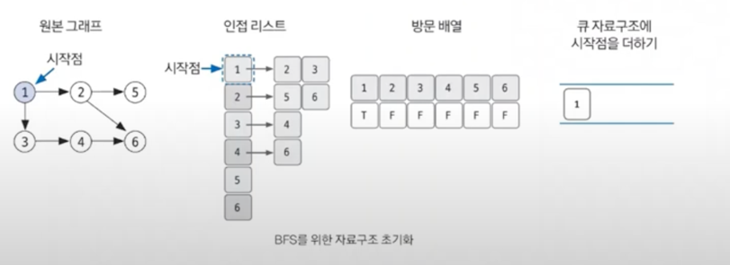
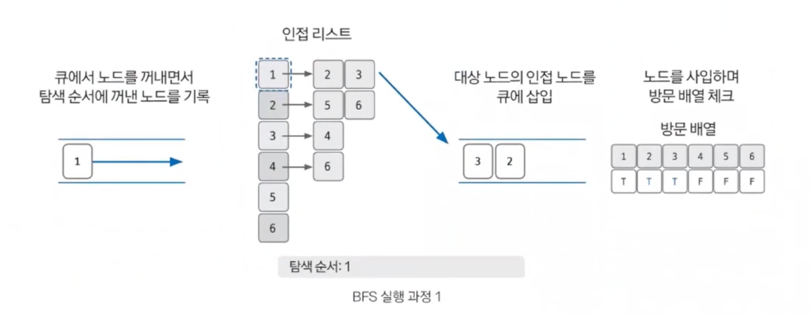
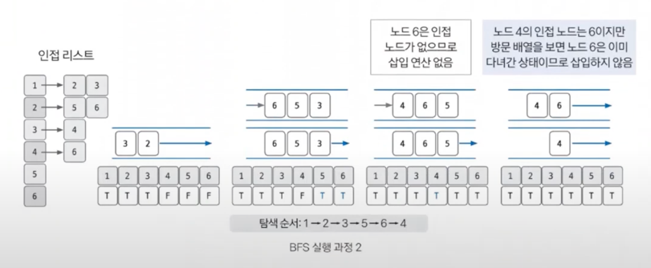

# BFS (너비우선탐색)

## 너비 우선 탐색 핵심 개념
- 그래프 완전 탐색 기법 중 하나 (완전탐색 = 모든 노드 조회)
- 시작 노드에서 출발,💥`가까운 노드`💥를 먼저 방문하며 탐색하는 알고리즘
- FIFO 탐색 / Queue 자료 구조로 이용
- 시간 복잡도 : O(V+E) ,V노드, E에지

## 구현을 위한 이론
- 한 번 방문한 노드를 다시 방문하면 안되므로 노드 방문 여부 체크할 배열 필요
- 그래프는 인접 리스트로 표현
- 스택이 아닌 큐 사용!

## 구현
1. BFS를 시작할 노드를 정한 후 사용할 자료구조 초기화하기

2. 큐에서 노드를 꺼낸 후 꺼낸 노드의 인접 노드를 다시 큐에 삽입하기

3. 큐 자료구조에 값이 없을 때 까지 반복하기
