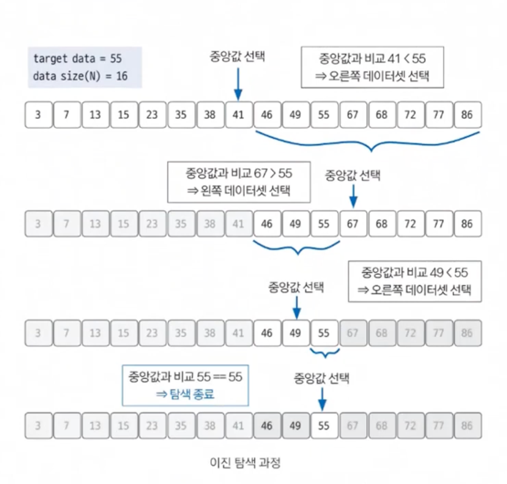

# 이진삼택

## 이진 탐색 핵심 개념
- 💥`데이터가 정렬`💥되어 있는 상태에서 원하는 값을 찾아내는 알고리즘
- 대상 데이터의 중앙값과 찾고자 하는 값 비교해 데이터 크기를 절반씩 줄이면서 대상을 찾음
- 즉, 특징 : `중앙값 비교를 통한 대상 축소 방`
- 시간 복잡도 : `O(logN` (예를 들어 16개 데이터면 최대 4번 연산)
- 구현 및 원리가 비교적 간단하므로 코뎅테스트에서 부분 문제로 요구하는 영역!

## 구현 (오름차순 정렬 데이터 기준)
1. 현재 데이터셋의 중앙값(평균값X, median값O)을 선택한다.
2. 중앙값 > 타깃 데이터일 때, 중앙값 기준으로 왼쪽 데이터셋을 선택한다.
3. 중앙값 < 타깃 데이터일 때, 중앙값 기준으로 오른쪽 데이터셋을 선택한다.
4. 과정 1~3을 반복하다가 중앙값 == 타깃 데이터일 때 탐색을 종료한다.
