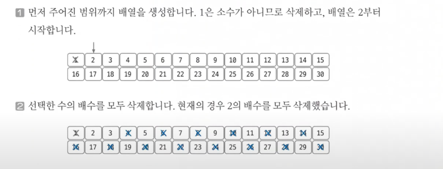
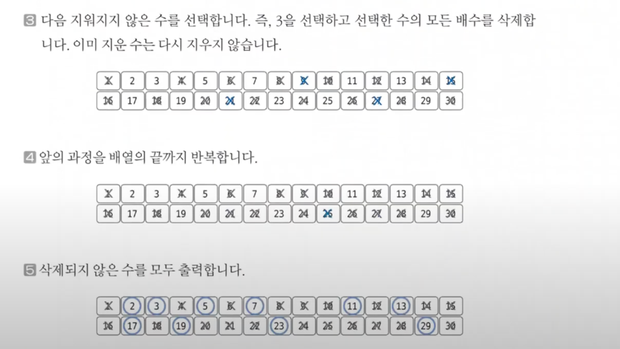
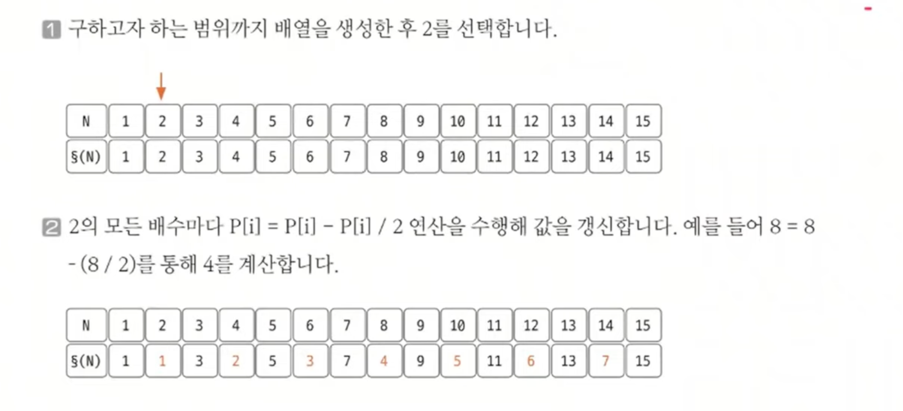
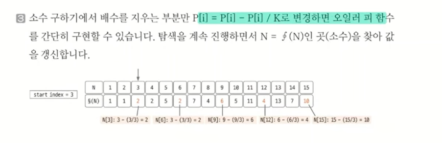
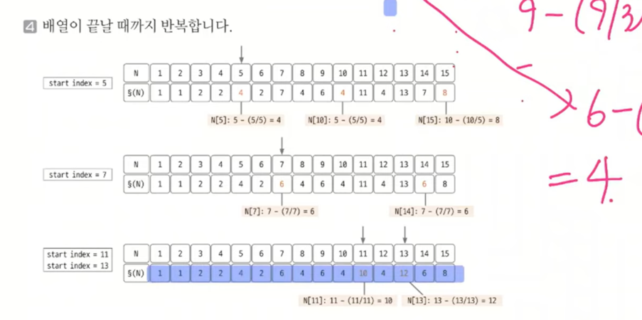
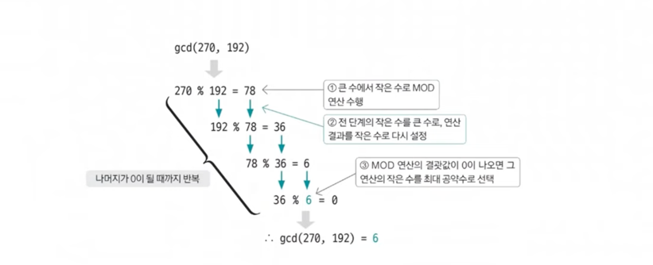

# 정수론

> 1. 소수 구하기 : 에라토스테네스의 체
> 2. 서로소 개수 구하기 : 오일러 피
> 3. 최대 공약수 구하기 : 유클리드 호제법

## 1. 에라토스테네스의 체
- 수학적 코딩테스트에 빈번하게 출제되는 부분, 완벽하게 숙지할 것.
- 소수 구하기 위한 알고리즘
- 소수 : 1과 자기 자신 외에 약수가 존재하지 않는 수

### 에라토스테네스의 체 원리
1. 구하고자 하는 소수의 범위만큼 1차원 배열 생성한다.
2. **2부터 시작하고 현재 숫자가 지워지지 않을 때는 현재 선택된 숫자의 배수에 해당하는 수를 배열에서 끝까지 탐색하면서 지운다. 이때 처음으로 선택된 숫자는 지우지 않는다.(=소수이기 때문이다.)**
3. 배열의 끝까지 2를 반복한 후 배열에서 남아있는 모든 수를 출력한다.

### 에라토스테네스의 체 예시
- 1부터 30까지의 수 중 소수를 구하는 예시

- 즉, 1부터 30까지의 수 중 소수는 2,3,5,7,11,13,17,19,23,29 이다.

### 에라토스테네스의 체 시간 복잡도
- 일반적으로 에라토스테네스의 체를 구현하려면 이중 for문을 이용하므로 시간복잡도가 O(N^2)이라 판단
- 하지만 실제 시간 복잡도는 최적화 정도에 따라 다르지만, 일반적으로 **O(Nlog(lonN))**
- 그 이유는 배수를 삭제하는 연산으로 실체 구현에서 바깥쪽 for문을 생략하는 경우가 빈번하기 때문

## 2. 오일러 피
- 많이 나오는 알고리즘은 아니지만, 알면 좋은 알고리즘

### 오일러 피 함수 P[N]의 정의
- 1부터 N까지 범위에서 N과 서로소인 자연수의 개수
  - 서로소란 공약수가 1이외에 없는 것.
- 예. P[6] = 2 (1, 5)

### 오일러 피 함수의 원리
1. 구하고자 하는 오일러 피의 범위만큼 배열을 자기 자신의 인덱스값으로 초기화한다.
2. **2부터 시작해 현재 배열의 값과 인덱스가 같으면(=소수일 때) 현재 선택된 숫자(K)의 배수에 해당하는 수를 배열에 끝까지 탐색하며 P[i] = P[i] - P[i]/K 연산을 수행한다. (i는 K의 배수)**
3. 배열의 끝까지 2를 반복하여 오일러 피 함수를 완성한다.

### 오일러 피 예시

### 오일러 피 함수 원리 쉽게 이해하기
- 초기 상태 P[6] = 6 -> 서로소가 될 수 있는 후보 개수로 초기화 `(1,2,3,4,5,6)`
- 2의 배수로 인한 탈락 -> P[6] = 6 - (6 / 2) = 6 - 3`(2,4,6)` = 3 `(1,3,5)`
- 3의 배수로 인한 탈락 -> P[6] = 3 - (3 / 3) = 3 - 1(3) = 2 `(1,5)`

## 3. 유클리드 호제법
- 두 수의 최대 공약수를 구하는 알고리즘
- 소인수분해보다 더 간단한 방법을 제시
- **코테에서는 재귀 형태로 구현!**

### MOD 연산이란?
- 두 값을 나눈 나머지를 구하는 연산
- 10 MOD 4 = 10 % 4 = 2

### MOD 연산으로 구현하는 유클리드 호제법 원리
1. 큰 수를 작은 수로 나누는 MOD연산을 수행한다.
2. 앞 단계에서 작은 수의 MOD 연산 결괏값(나머지)으로 MOD 연산을 수행한다.
3. 단계 2를 반복하다가 **나머지가 0이 되는 순간의 작은 수를 최대 공약수로 선택**한다.

### 유클리드 호제법 예시
- 270과 192의 최대 공약수를 유클리드 호제법으로 찾아보는 예시

