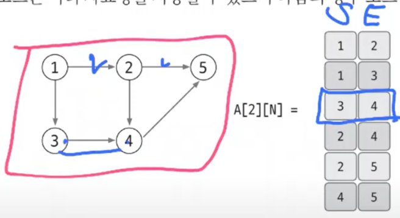
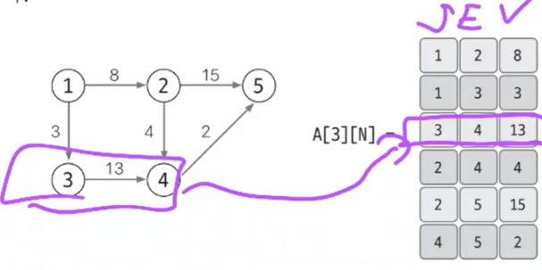
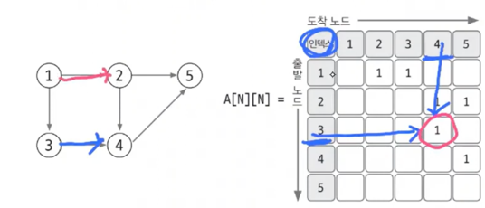
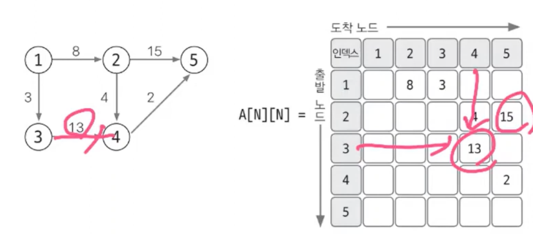
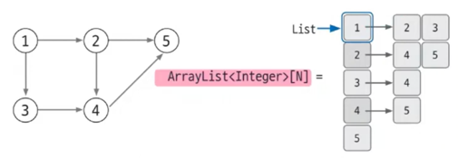
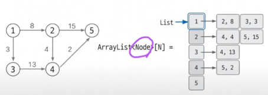

# 그래프
> 그래프를 구현하는 방법 3가지
> 1. [에지 리스트](#1-에지-리스트)
> 2. [인접 행렬](#2-인접-행렬)
> 3. [인접 리스트 (🤩)](#3-인접-리스트-(제일중요!🤩))

## 그래프 구성요소
1. 노드
2. 에지 : 노드를 잇는다.

## 1. 에지 리스트
- 에지를 중심으로 그래프를 표현
- 구현은 굉장히 쉬움
- 단, **특정 노드와 관련된 에지를 탐색 어려움** : 모든 배열 다 확인해야함 : O(N) -> 시간복잡도가 높음
- 따라서 에지 중심으로 조회해야 하는 경우에만 사용 -> 벨판포드, 크루스칼 알고리즘에 사용

### (1) 가중치 없는 그래프 표현하기

- 에지를 저장하는 배열 정의하여 사용 `A[2][N]`
- 첫 번째 칸은 시작노드, 두번째 칸은 끝노드를 저장
- 만약 방향이 없는 그래프라면 그냥 [1,2], [2,1] 저장해서 사용하기

### (2) 가중치 있는 그래프 표현하기

- 시작노드, 끝노드, 가중치를 저장하는 배열 정의하여 사용 `A[3][N]`

## 2. 인접 행렬
- 2차원 배열을 자료구조로 이용하여 그래프를 표현
- 에지 리스트와 다르게 **노드 중심**으로 그래프를 표현
- 구현은 쉽고, 노드로 조회하기 쉬움.
- 하지만, 노드와 관련된 에지를 탐색하려면 N번 접근해야 하므로 **노드 개수에 비해 에지가 적을 때는 공간 효율성이 떨어짐**
- 적절하게 판단하고 사용해야 하는 알고리즘

### (1) 가중치 없는 그래프 표현하기

- `A[N][N]` 이차원 배열 만들어 사용
- 1 : 에지가 있다, 0 : 에지가 없다

### (2) 가중치 있는 그래프 표현하기

- 2-(1) 그래프에서 값으로 가중치를 넣으면 됨

### 3. 인접 리스트 (제일중요!🤩)
- 인접리스트로 푸는 문제가 제일 많음
- 에지 중심이 아닌 노드 중심으로 풀기 좋음
- 구현은 복잡한 편이지만, **노드와 연결된 에지 탁색하는 시간이 매우 뛰어남**
- 노드 개수가 커도 **공간 효율이 좋아 메모리 초과 에러가 발생하지 않음**
- 코테에서 실제로 인접 리스트를 이용한 그래프 구현을 선호!

### (1) 가중치 없는 그래프 표현하기

- **배열**로 선언 `ArrayList<Integer>[N]`
- 가변적(=있는 값만 넣을 수 있음)이고 인덱스로 직접 접근이 가능(=노드로 바로 접근 가능)하다는 특징
- 노드를 연결하고자 한다면 예. `A[3].add(4)`

### (2) 가중치 있는 그래프 표현하기 (90%이상의 문제는 가중치 있음)

- 3-(1)과 다른 점은 타입이 Integer이 아니라 **클래스**  `ArrayList<Node>[N]`, `class Node{...}`
- `class Node` - `int E`(끝노드), `int V`(가중치) 를 가지도록 설계
- - 노드를 연결하고자 한다면 예. `A[3].add(new Node(4,3))`
