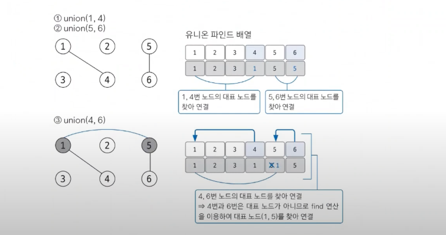
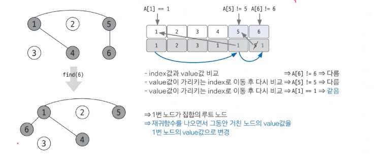

# 유니온 파인드

> 그래프 알고리즘
> 1. **유니온파인드**
> 2. 위상정렬
> 3. 다익스트라 `최단거리알고리즘`
> 4. 벨만포드 `최단거리알고리즘`
> 5. 플로이드 워셜 `최단거리알고리즘`
> 6. 최소신장트리 (MST)

## 참고

- 그래프 영역이라 보기엔 무리가 있지만, 부분 알고리즘으로 활용됨.
- 간단하지만 유용한 알고리즘이니 꼭 숙지!

## 유니온파인드를 구성하는 2가지 연산

- 여러 노드가 있을 때 특정 2개의 노드를 연결해 1개의 집합으로 묶는 **union 연산**
- 두 노드가 같은 집합에 속해있는지를 확인하는 **find 연산**

## 핵심 이론

- union, find 연산을 완벽히 이해하는 것이 핵심!

## 원리 이해하기

### 1. 초기화

- 배열에 각각 자기의 인덱스 값으로 초기화
- 배열 = 대표 노드 저장 배열

### 2. union 연산 수행

- union(1,4) -> 그래프에서의 의미 : 1과 4번 노드를 연결한다. -> 대표값 변경한다.
- 💥 Union연산 주의! - **항상 대표 노드끼리 연결해준다!**
- 예시 (작은 것을 대표값 선정 기준으로 임의로 정하자.)
    - #1. union(1,4) ->  4번 노드의 대표값을 1로 변경
    - #2. union(5,6) -> 6번 노드 대표값을 5로 변경
    - #3. union(4,6) -> 4,6은 대표노드가 아님(인덱스 != 대표값) -> 각 노드의 대표값으로 찾아 올라간 다음 대표 노드로 연결

### 3. find 연산 수행

- 자신이 속한 집합의 대표 노드를 찾는 연산, **그래프를 정돈하고 시간복잡도 향상시킴**
- (1) 대상 노드 배열에 index == value 인지 확인
- (2) index != value 라면 value값이 가리키는 Index 위치로 이동
- (3) 이동 위치의 index == value 일때까지 (1)~(2) 반복 (= 대표노드 찾을 떄 까지) **재귀함수로 구현**
- (4) 대표 노드에 도달하면 재귀 함수를 빠져나오면서 거치는 모든 노드값을 루트 노드값으로 변경
    - 💥시간복잡도줄이는효과!💥 경로압축은 실제 그래프에서 여러 노드를 거쳐야 하는 경로에서 그래프를 변형해 더 짧은 경로로 갈 수 있도록 함으로써 시간복잡도를 효과적으로 줄이는 방법

