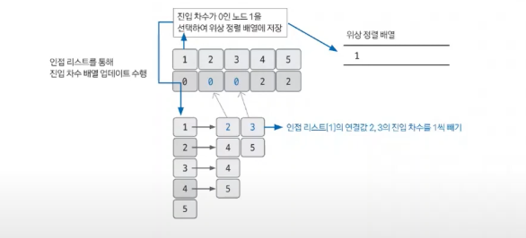

# 위상정렬

> 그래프 알고리즘
> 1. 유니온파인드
> 2. **위상정렬**
> 3. 다익스트라 `최단거리알고리즘`
> 4. 벨만포드 `최단거리알고리즘`
> 5. 플로이드 워셜 `최단거리알고리즘`
> 6. 최소신장트리 (MST)

## 위상정렬이란?
- 사이클이 없는 방향 그래프에서 노드 순서를 찾는 알고리즘
- O(V+E) (V:노드수, E:에지수)
- 항상 유일한 값으로 정렬되지 않는다.
- 사이클이 존재하면 안된다. 

## 핵심 이론
한마디로 -> 진입차수 배열을 이용한 정렬
### 1. 인접리스트로 그래프 표현 & 진입차수 배열 업데이트
- 진입차수 : 자기 자신을 가리키는 에지의 개수
- 그래프를 인접리스트로 표현하면서 진입차수 배열 업데이트

### 2. 위상 정렬 배열 값 입력
- (1) **진입 차수가 0인 노드**를 선택해 위상 정렬 배열에 저장
- (2) 인접 리스트에서 선택된 노드가 가리키는 노드들의 진입 차수를 1씩 뺌
- 남은 노드 중 진입차수가 0인 노드 선택해 (1)~(2) 반복, 모든 노드가 정렬될 때 까지 반복

