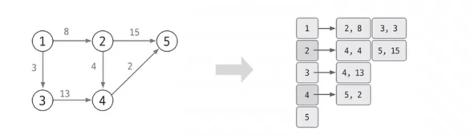
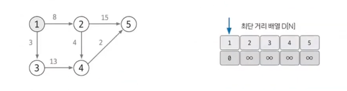
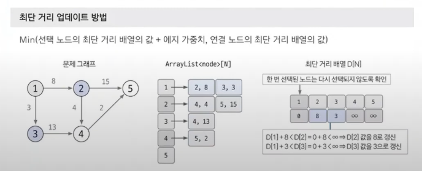
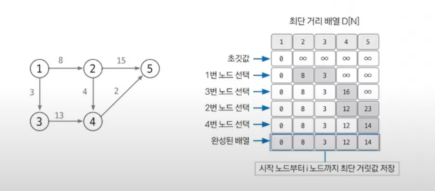

# 다익스트라

> 그래프 알고리즘
> 1. 유니온파인드
> 2. 위상정렬
> 3. **다익스트라** `최단거리알고리즘`
> 4. 벨만포드 `최단거리알고리즘`
> 5. 플로이드 워셜 `최단거리알고리즘`
> 6. 최소신장트리 (MST)

## 다익스트라 정의 및 특징
- **최단 거리**를 구하는 알고리즘
- 출발 노드와 모든 노드 간의 최단 거리 탐색
- 에지는 모두 **양수**여야 한다.
- 시간복잡도 : O(ElogV) (노드수:V, 에지수:E)

## 핵심 이론

### 1. 인접리스트로 그래프 구현
- 데이터를 자료구조에 저장
- 인접행렬로 구현해도 좋지만, 시간복잡도 측면, N의 크기가 큰 것을 대비해 인접리스트를 선택해 구현하는 것이 좋음.

### 2. 최단 거리 배열 초기화
- 최단 거리 배열을 만들고, 출발 노드는 0, 이외의 노드는 무한으로 초기화
- 이때 무한은 적당히 큰 값으로 사용 (그림에서는 ∞로 표현)

### 3. 값이 가장 작은 노드 고르기 💥
- 최단 거리 배열에서 현재 값이 가장 작은 노드 선택
- (처음일 경우, 당연히 시작 노드가 제일 작음. 시작노드부터 시작.)

### 4. 최단 거리 배열 업데이트 💥
- 선택된 노드에 연결된 에지의 값을 바탕으로 다른 노드 값 업데이트
- **Min(선택 노드의 최단 거리 배열 값 + 에지 가중치, 연결 노드의 최단 거리 배열 값)**

### 5. 과정 3~4 반복해 최단 거리 배열 완성하기
- 과정 4에서 선택 노드가 될 때마다 다시 선택되지 않도록 방문 배열 만들어 처리
- 모든 노드가 선택될 때 까지 반복하면 최단 거리 배열 완성

## 최종 완성된 배열의 의미
- 최단 거리 배열은 결국 '시작노드부터 마지막 노드까지의 각각 최단 거리값'이 저장되어 있다.
- 문제에서 잘 활용할 수 있도록 숙지하자.
