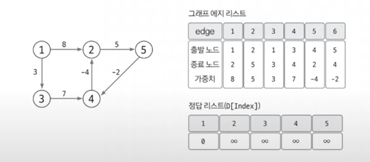
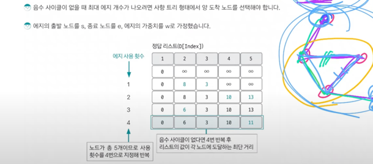
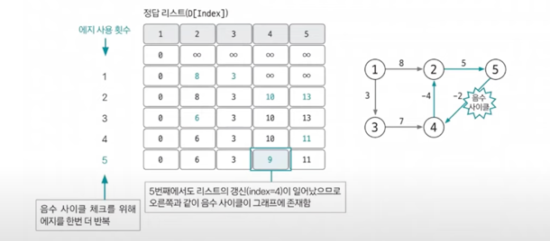

# 다익스트라

> 그래프 알고리즘
> 1. 유니온파인드
> 2. 위상정렬
> 3. 다익스트라 `최단거리알고리즘`
> 4. **벨만포드** `최단거리알고리즘`
> 5. 플로이드 워셜 `최단거리알고리즘`
> 6. 최소신장트리 (MST)

## 벨만포드 정의 및 특징

- **최단 거리**를 구하는 알고리즘
- 음수 가중치를 다룰 수 있다. (제일 중요한 특징)
- 음수 가중치 관련 문제라면 90% 이상은 벨만포드 활용
- 그래프에서 음수 사이클 존재 여부 판단하는 문제로 많이 나옴! (제일 중요한 특징)
- 시간복잡도 : O(VE)

## 동작 원리
> 한마디로 정리하자면
> (1) 최단거리 N-1 에지로 업데이트
> (2) 한 번 더 업데이트 시도해 음수 사이클 확인

### 1. 에지리스트로 그래프 구현, 최단경로 리스트 초기화

- 벨만포드는 에지를 중심으로 동작하므로 **에지 리스트로 구현**
- 최단 경로 리스트를 출발노드는 0, 나머지는 무한대로 초기화

### 2. 모든 에지를 확인해 정답 리스트 업데이트

- **업데이트 반복 횟수는 <노드 개수 -1>**
    - 노드 개수가 N이고, 음수 사이클이 없을 때 특정 두 노드의 최단 거리를 구성할 수 있는 에지의 최대 개수는 N-1이기 때문
- 모든 에지 E(s, e, w)에서 다음 조건을 만족하면 업데이트 실행
    - D[s] != ∞ && D[e] > D[s] + w -> D[e] = D[s] + w
- 업데이트 반복 횟수가 K번이라면 해당 시점에서 정답 리스트의 값은 시작점에서 K개의 에지를 사용했을 때 각 노드에 대한 최단거리

### 3. 마무리 (음수 사이클 유무 확인)
- 음수 사이클이 없을 때 N-1번 에지 사용 횟수를 반복하면 출발노드와 모든 노드 간의 최단 거리를 알려주는 정답 리스트 완성
- 완성된 후 마지막으로 이 그래프에 음수 사이클이 존재하는지 확인해야 합니다.

## 음수 사이클 확인하기 (자주 나오는 유형)
- 모든 에지를 한 번씩 다시 사용해 업데이트 되는 노드가 발생하는지 확인
  - 만약 업데이트되는 노드가 있다면 음수 사이클이 있다는 뜻
  - 2단계에서 도출한 정답 인사이클을 무한하게 돌수록 가중치가 계속 감소하므로 최단 거리를 구할 수 없음

