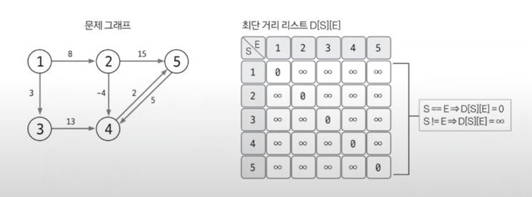
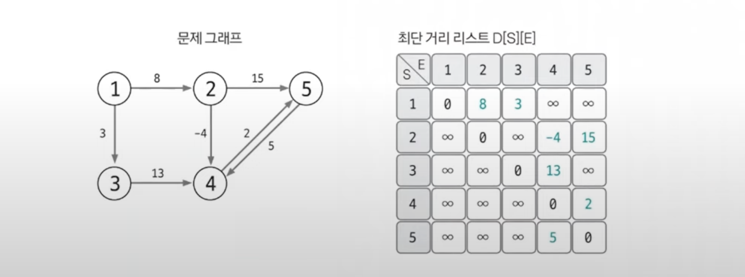
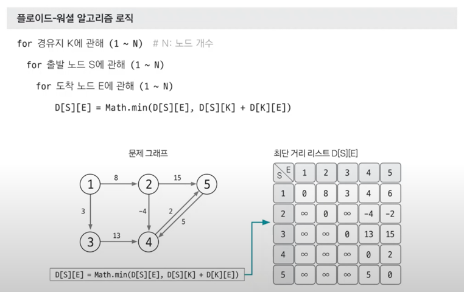

# 플로이드 워셜

> 그래프 알고리즘
> 1. 유니온파인드
> 2. 위상정렬
> 3. 다익스트라 `최단거리알고리즘`
> 4. 벨만포드 `최단거리알고리즘`
> 5. **플로이드 워셜** `최단거리알고리즘`
> 6. 최소신장트리 (MST)


## 특징
- 모든 노드 간에 최단 경로를 탐색
- 음수 가중치 에지가 있어도 수행할 수 있음
- 동적계획법의 원리를 이용해 알고리즘에 접근
- 시간복잡도 : O(V^3) -> N = 200, 100.. 정도로 작은 경우만 가능

## 핵심 이론
- A노드에서 B노드까지 최단 경로를 구했다고 가정했을 때 최단 경로 위에 K 노드가 존재한다면 그것을 이루는 부분 경로 역시 최단 경로
- 전체의 최단경로 = 각 부분의 최단경로의 합

## 점화식
```text
D[S][E] = Math.min(D[S][E], D[S][K] + D[k][E])
```
- 모든 중간 노드 K를 탐색

## 풀이법
### 1. 리스트를 선언하고 초기화하기
- S==E -> 0 / 나머지는 무한대로 초기화
- 왜냐하면 S == E : 자신에게 가는데 걸리는 최단 경로 값을 의미



### 2. 최단 거리 리스트에 그래프 데이터 저장하기
- 인접행렬 정의한다



### 3. 점화식으로 리스트 업데이트하기 💥
- 3중 for문 형태로 반복하며 리스트 값 업데이트
- 기억하기!!! 제일 바깥이 K! 그 이후 출발노드, 도착노드 순서!!


