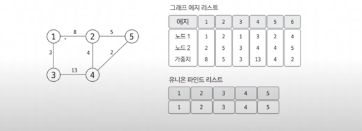
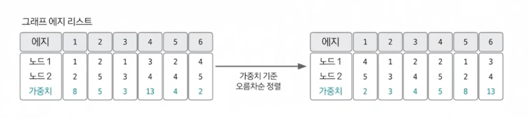
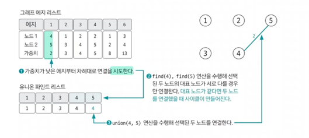
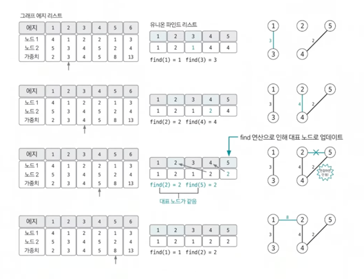

# 최소 신장 트리 (MST)

> 그래프 알고리즘
> 1. 유니온파인드
> 2. 위상정렬
> 3. 다익스트라 `최단거리알고리즘`
> 4. 벨만포드 `최단거리알고리즘`
> 5. 플로이드 워셜 `최단거리알고리즘`
> 6. **최소신장트리 (MST)**

## 최소 신장 트리 정의
- 그래프에서 모든 노드를 연결할 때 사용된 에지들의 가중치 합을 최소로 하는 트리
- MST -> **크루스칼 알고리즘**, 프림 알고리즘

## 최소 신장 트리 특징
- 사이클이 포함되면 가중치의 합이 최소가 될 수 없으므로 사이클을 포함하지 않는다.
- N개의 노드가 있으면 최소 신장 트리를 구성하는 에지의 개수는 항상 N-1개이다.

## 핵심 이론

### 1. 에지리스트로 그래프 구현, 유니온파인드 리스트 초기화
- 데이터를 노드가 아닌 에지 중심으로 저장하므로 인접리스트가 아닌 **에지 리스트로 구현**
- 유니온 파인드 리스트 함께 초기화 (인덱스 값으로 초기화)

### 2. 그래프 데이터를 가중치 기준으로 정렬하기
- 가중치 기준으로 **오름차순** 정렬

### 3. 가중치가 낮은 에지부터 연결 시도하기
- 가중치가 낮은 에지부터 순서대로 선택해 연결 시도
- 이 때 바로 연결하지 않고, 그래프에 사이클 형성 유무를 find 연산을 이용해 확인 후 사이클이 형성되지 않을 때만 union 연산 이용해 두 노드 연결

### 4. 과정 3 반복하기
- 전체 노드 개수가 N개라면 연결한 에지의 개수가 N-1이 될 때 까지 과정3 반복

### 5. 총 에지 비용 출력하기
- 에지의 개수가 N-1이 되면 알고리즘 종료
- 완성된 최소 신장 트리의 총 에지 비용을 출력

