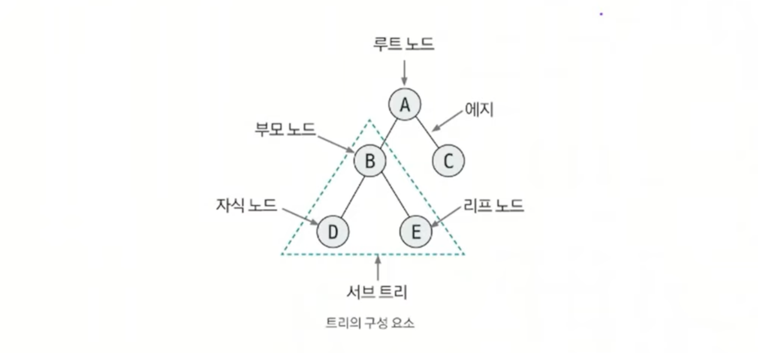
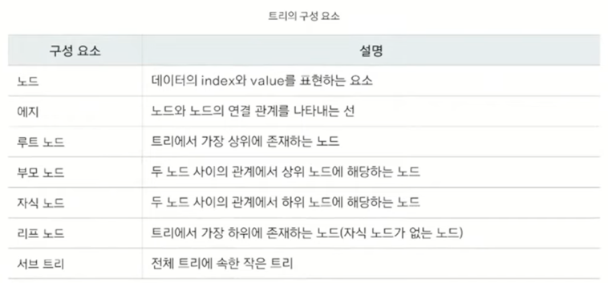

# 트리

## 트리의 특징
트리는 노드와 에지로 연결된 **그래프의 특수한 형태** (그래프의 표현으로도 tree를 표현할 수 있음)
- 순한 구조를 지니고 있지 않고, 1개의 루트 노드가 존재한다.
- 루트 노드를 제외한 노드는 단 1개의 부모 노드를 갖는다.
- 트리의 부분 트리 역시 트리의 모든 특징을 따른다.
- **트리에서 임의의 두 노드를 이어주는 경로는 유일하다.**

## 트리 구성요소

## 코딩테스트에서의 트리 문제 유형
코테에서 tree문제는 크게 두 가지 유형이 있다.
### 1. 그래프로 푸는 tree
- **인접 리스트**로 표현 -> **DFS/BFS 알고리즘** 활용

### 2. tree만을 위한 문제
- **이진트리 & 세그먼트 트리(인덱스 트리) & LCA(최소공통조상)**
- 어려운 문제 유형이라 인접 리스트로 풀지 않고, **1차원 배열**로 tree를 표현한다.
  - `index/2` 부모 노드로 이동
  - `index*2` `index*2+1` 자식 노드로 이동
