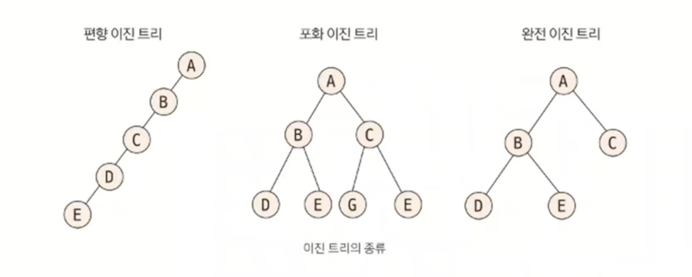
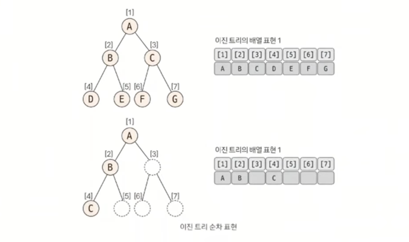
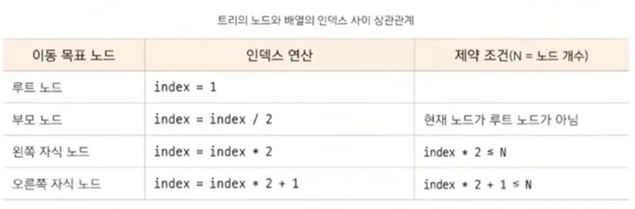

# 이진트리
> 트리의 종류
> 1. **이진트리**
> 2. 세그먼트 트리 (인덱스 트리)
> 3. LCA (공통 조상 트리)

## 이진 트리란?
- **각 노드의 자식 노드(차수)의 개수가 2 이하**로 구성된 트리
- 이진트리는 일차원 배열로 표현해 푸는 문제
- 세그먼트 트리, LCA 모두 이진트리 형태이므로 이진트리의 개념 숙지 필수

## 이진 트리 종류
코딩테스트에서 크게 중요한 개념은 아니니 참고만 하자.

- 편향 이진 트리 : 노드들이 한쪽으로 편향돼 생성된 이진트리
  - 편향 이진 트리의 형태로 저장하면 탐색 속도가 저하되고 공간이 많이 낭비되는 단점
  - 일반적 코테에서 데이터를 트리에 담는다고 하면 완전 이진트리 형태를 떠올리면 됨.
- 포화 이진 트리 : 트리의 높이가 모두 일정하며 리프 노드가 꽉 찬 이진 트리
- **완전 이진 트리** : 마지막 레벨을 제외하고 완전하게 노드들이 채워져있고, 마지막 레벨은 왼쪽부터 채워진 트리

## 이진트리의 순차 표현 (★)
가장 직관적이며 편리한 트리 자료구조 형태인 **배열**로 표현한다.

## 배열의 인덱스 간의 상관관계 (★★★)
