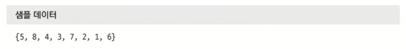
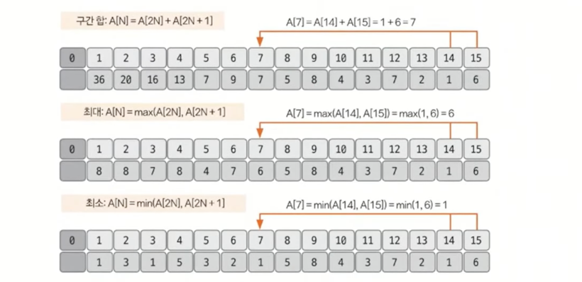
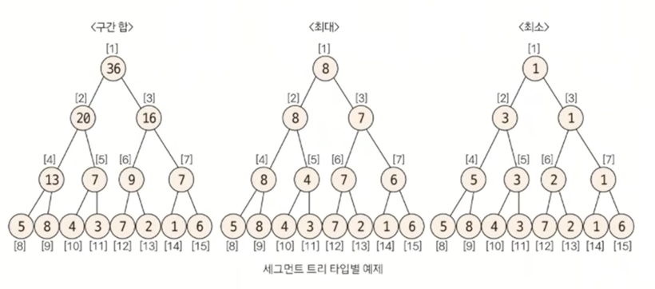

# 이진트리
> 트리의 종류
> 1. 이진트리
> 2. **세그먼트 트리 (인덱스 트리)**
> 3. LCA (공통 조상 트리)

## 세그먼트 트리란?
- 주어진 데이터의 **구간 합**과 **데이터 업데이트를 빠르게** 수행하기 위해 고안해낸 자료구조 형태
- 더 큰 범위는 인덱스 트리인데, 코테에서는 큰 차이가 없다고 생각해도 무방

## 💥 핵심 이론 - 1. 트리 초기화 방법(★★)
<U>리프 노드만 원본 데이터</U>인 트리를 생성하는 것.
### 1. 트리 배열 크기 지정
- **2^k >= N 을 만족하는 k의 최솟값을 구한 후 2^k * 2를 트리 배열의 크기**로 지정
### 2. 원본 데이터 입력
- **2^k를 시작 인덱스**로 취해 원본 데이터를 입력한다.

### 3. 리프노드 제외한 나머지 노드 값 채우기
- 채워야 할 노드의 자식 노드를 이용해 값을 채운다.
- 인덱스가 N이라면, 자식 노드는 2N, 2N+1이 된다.

## 💥 핵심 이론 - 2. 질의값 구하는 방법(★★★)
### 1. 주어진 질의 인덱스를 세그먼트 트리의 리프 노드에 해당하는 인덱스로 변경
- 세그먼트 트리 index = 주어진 질의 index + 2^k - 1

### 2. 질의값 구하기 (⚠️어려움주의⚠️)
1. start_index % 2 == 1일때 해당 노드를 선택한다.
2. end_index % 2 == 0일때 해당 노드를 선택한다.
3. start_index depth 변경 : start_index = (start_index + 1) / 2 연산을 실행한다.
4. end_index depth 변경 : end_index = (end_index - 1) / 2 연산을 실행한다.
5. 1~2를 반복하다가 end_index < start_index가 되면 종료한다.

## 💥 핵심 이론 - 3. 데이터 업데이트 방법(★★)

## 요약 정리
