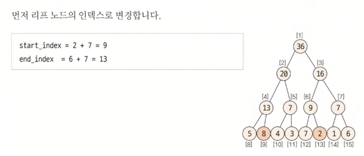
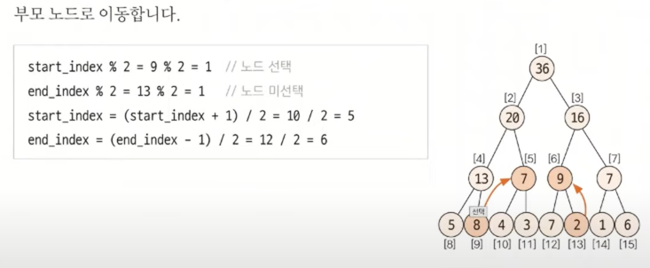
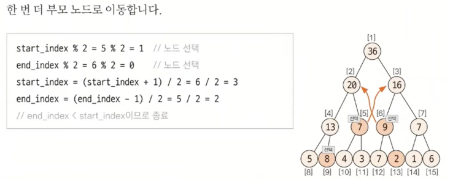

# 세그먼트 트리 (인덱스 트ㅇㅇ)

> 트리의 종류
> 1. 이진트리
> 2. **세그먼트 트리 (인덱스 트리)**
> 3. LCA (공통 조상 트리)

## 세그먼트 트리란?

- 주어진 데이터의 **구간 합**과 **데이터 업데이트를 빠르게** 수행하기 위해 고안해낸 자료구조 형태
- 더 큰 범위는 인덱스 트리인데, 코테에서는 큰 차이가 없다고 생각해도 무방
- **🌟구간합을 구하는데, 값 업데이트가 발생한다 -> 세그먼트 트리🌟**

## 💥 핵심 이론 - A. 트리 초기화 방법(★★)

<U>리프 노드만 원본 데이터</U>인 트리를 생성하는 것.

### 1. 트리 배열 크기 지정

- **2^k >= N 을 만족하는 k의 최솟값을 구한 후 2^k * 2를 트리 배열의 크기**로 지정

### 2. 원본 데이터 입력

- **2^k를 시작 인덱스**로 취해 원본 데이터를 입력한다.

### 3. 리프노드 제외한 나머지 노드 값 채우기

- 채워야 할 노드의 자식 노드를 이용해 값을 채운다.
- 인덱스가 N이라면, 자식 노드는 2N, 2N+1이 된다.

## 💥 핵심 이론 - B. 질의값 구하는 방법(★★★)

### 1. 주어진 질의 인덱스를 세그먼트 트리의 리프 노드에 해당하는 인덱스로 변경

- `세그먼트 트리 index` = `주어진 질의 index + 2^k - 1`

### 2. 질의값 구하기 (⚠️어려움주의⚠️)

1. start_index % 2 == 1일때 해당 노드를 선택한다.
2. end_index % 2 == 0일때 해당 노드를 선택한다.
3. start_index depth 변경 : start_index = (start_index + 1) / 2 연산을 실행한다.
4. end_index depth 변경 : end_index = (end_index - 1) / 2 연산을 실행한다.
5. 1~2를 반복하다가 end_index < start_index가 되면 종료한다.

> - 1~2 : 해당 노드의 부모가 나타내는 범위가 질의 범위를 넘어가기 때문에 해당 노드를 질의값에 영향을 미치는 독립 노드로 선택하고, 해당 노드의 부모 노드는 대상 범위에서 제외한다는 뜻
> - 3~4 : 질의 범위에 해당하는 부모 노드로 이동하기 위해 인덱스 연산을 index/2가 아닌 (index+1)/2, (index-1)/2로 수행한다는 것

### 😈 예시

2~6까지의 구간합을 구한다고 가정해보자.  
2, 6을 각각 트리 인덱스로 바꿔준다.

부모 노드를 계산한다.  
트리 인덱스가 홀수라면 오른쪽에 있는 노드이다.  
start_index [9]는 홀수이므로(오른쪽에 위치한 자식노드) 부모 노드인 [4]은 필요 없는 값인 [8]도 합한 값이기 때문에 필요없다.  
따라서 부모 노드로 [4]를 선택하지 않고, [9]의 값만 따로 킵해두고 [5]를 부모 노드로 선택한다.
end_index [13]의 부모노드인 [6]의 경우, 온전히 범위만을 포함하기 때문에 부모 노드로 선택한다.

위와 동일하게 반복한다.  
start_index가 end_index보다 크다면 반복을 종료한다.  
최종적으로 구한 부모노드 두 개(7,9) 더하고, 킵했던 값(8)도 더해주면 구간합(24)이 나온다.

## 💥 핵심 이론 - C. 데이터 업데이트 방법(★★)

1. 리프 노드 값을 변경한다.
2. 부모 노드로 이동해서 (**index / 2**) 값을 업데이트한다.
3. 2를 반복하며 업데이트한다.
    - 최대, 최소 : 업데이트가 일어나지 않으면 종료한다.
    - 합 : 루트노드까지 업데이트한 후 종료한다.

## 요약 정리

### 세그먼트 트리 단계

1. 트리 초기화하기
    1. 크기 정하기 (`2^k >= N`의 `2^k * 2`)
    2. 리프노드 채우기 (start_index = `2^k`)
    3. 부모 노드 값 채우기 (부모인덱스 = `index / 2`)
2. 질의값 구하기
    1. 질의 index를 트리에 맞게 변경 (트리 인덱스 =`질의index + 2^k - 1`)
    2. 노드 값 선택 (`start_index 홀수`일때, `end_index 짝수`일때 선택)
    3. start_index < end_index 일 떄 까지 부모 노드 값 선택 (`(start_index + 1) / 2`, `(end_index -1) / 2`)
3. 값 업데이트
    1. 트리의 특성을 살려 부모로 가며 값 업데이트
