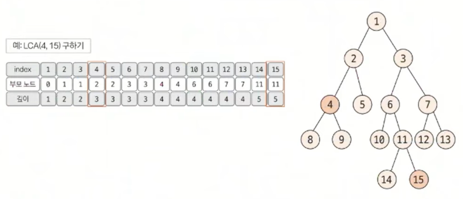
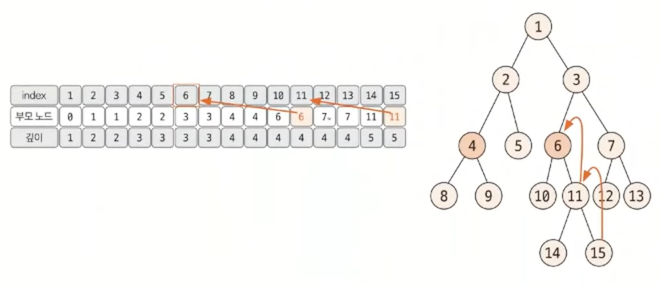
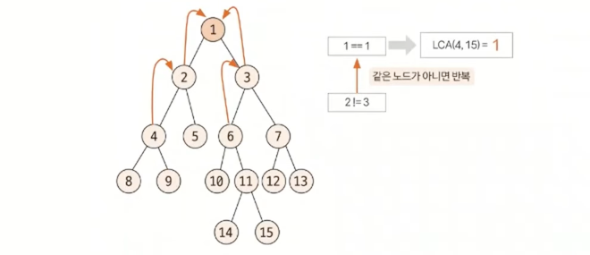

# 최소 공통 조상 트리 (LCA)

> 트리의 종류
> 1. 이진트리
> 2. 세그먼트 트리 (인덱스 트리)
> 3. **최소 공통 조상 (LCA)**

## 최소 공통 조상(LCA) 란?

- Lowest Common Ancestor
- 트리 그래프에서 임의의 두 노드를 선택했을 때 두 노드가 각각 자신을 포함해 거슬러 올라가면서 부모 노드를 탐색할 때 처음 공통으로 만나게 되는 부모노드를 최소 공통 조상이라 한다.
- LCA를 구하는 방법은 <U>(1)기본방법</U>과 <U>(2)빠른방법</U>이 있다.
- 트리의 높이가 커질 경우 **시간 제약 문제**에 직면하므로 <U>(2)빠른방법</U>을 숙지해야 한다.

## (1) LCA 기본 방법

> **트리의 높이가 크지 않을 때** 사용한다. 즉, 시간 제한이 널널할 때 사용한다.

### 1️⃣ 탐색을 통하여 <U>깊이</U>와 <U>부모 노드</U> 저장하기 (★★)

- 탐색은 DFS 혹은 BFS를 이용해 수행한다.
- 루트 노드에서 탐색을 시작하며 값을 저장한다.
- 바로 직전 탐색 노드가 부모노드가 된다.

### 2️⃣ 두 노드의 깊이 맞춰주기 (★)

- 선택된 두 노드의 깊이가 다른 경우, 더 깊은 노드의 노드를 부모 노드로 1개씩 올려주며 같은 깊이로 맞춘다.
- 이때, 두 노드가 같으면 해당 노드가 최소 공통 조상이므로 탐색 종료한다. (예. 3과 15 -> 3과 3 -> 종료)

### 3️⃣ 동시에 올라가면서 공통 조상 찾기 (★)
- 깊이가 같은 상태에서 동시에 부모 노드로 올라가며, 두 노드가 같은 노드가 될 때 까지 반복한다.
- 반복하다 처음 만나는 노드가 최소 공통 조상이 된다.

## (2) LCA 빠른 방법

### 1️⃣ 부모 노드 저장 배열의 의미와 점화식 (★★★)

### 2️⃣ 두 노드의 깊이 빠르게 맞추기(★)

### 3️⃣ 공통 조상 빠르게 찾기(★)

