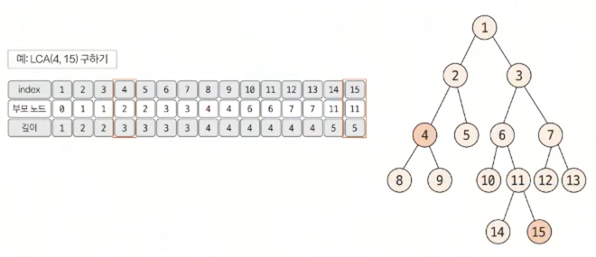
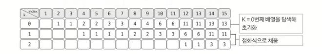
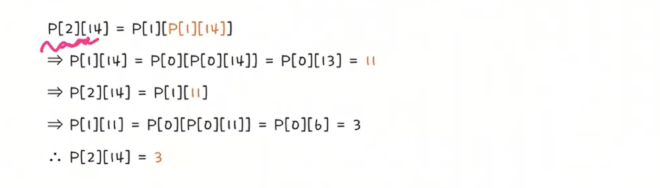

# 최소 공통 조상 트리 (LCA)

> 트리의 종류
> 1. 이진트리
> 2. 세그먼트 트리 (인덱스 트리)
> 3. **최소 공통 조상 (LCA)**

## 최소 공통 조상(LCA) 란?

- Lowest Common Ancestor
- 트리 그래프에서 임의의 두 노드를 선택했을 때 두 노드가 각각 자신을 포함해 거슬러 올라가면서 부모 노드를 탐색할 때 처음 공통으로 만나게 되는 부모노드를 최소 공통 조상이라 한다.
- LCA를 구하는 방법은 <U>(1)기본방법</U>과 <U>(2)빠른방법</U>이 있다.
- 트리의 높이가 커질 경우 **시간 제약 문제**에 직면하므로 <U>(2)빠른방법</U>을 숙지해야 한다.

## (1) LCA 기본 방법

> **트리의 높이가 크지 않을 때** 사용한다. 즉, 시간 제한이 널널할 때 사용한다.

### 1️⃣ 탐색을 통하여 <U>깊이</U>와 <U>부모 노드</U> 저장하기 (★★)

- 탐색은 DFS 혹은 BFS를 이용해 수행한다.
- 루트 노드에서 탐색을 시작하며 값을 저장한다.
- 바로 직전 탐색 노드가 부모노드가 된다.



### 2️⃣ 두 노드의 깊이 맞춰주기 (★)

- 선택된 두 노드의 깊이가 다른 경우, 더 깊은 노드의 노드를 부모 노드로 1개씩 올려주며 같은 깊이로 맞춘다.
- 이때, 두 노드가 같으면 해당 노드가 최소 공통 조상이므로 탐색 종료한다. (예. 3과 15 -> 3과 3 -> 종료)


### 3️⃣ 동시에 올라가면서 공통 조상 찾기 (★)

- 깊이가 같은 상태에서 동시에 부모 노드로 올라가며, 두 노드가 같은 노드가 될 때 까지 반복한다.
- 반복하다 처음 만나는 노드가 최소 공통 조상이 된다.


## (2) LCA 빠른 방법

> <(1) LCA 기본방법>과 다른 점은 1씩 올라가는 것이 아니라 **2^k씩 올라가는 것**이다.

### 1️⃣ 부모 노드 저장 배열의 의미와 점화식 (★★★)

- 이차원 배열을 통해 부모 노드를 저장한다.
- P[K][N] = N번 노드의 2^k번째 부모의 노드 번호
- 배열에서 K는 `트리의 깊이 > 2^k를 만족하는 최댓값`

#### 🌟 **부모 노드 배열의 점화식**

```text
P[K][N] = P[K-1][P[K-1][N]]
```

- P[2][N] = P[1][P[1][N]]
- 👉️ N의 두 번째 부모 = N의 첫 번째 부모의 첫 번째 부모

#### 🌟 **배열 채우는 방법**

- [1] 먼저 DFS / BFS 탐색을 통해 k=0일 때 값을 채워넣는다.
- [2] 이후 점화식을 이용해 K를 1씩 증가시키며 나머지 배열을 채운다.
  
  

### 2️⃣ 두 노드의 깊이 빠르게 맞추기(★)

- 2^k 단위로 넘어가면서 맞춘다.
- `2^k <= 높이차` 을 만족하면서 `K가 최대`가 되는만큼 이동 반복
- 높이 차이가 0이라면 반복 종료
- 예시 1
  - [노드2] 깊이 2, [노드15] 깊이 6
  - 두 노드의 깊이 차이 = 4
  - 더 깊이 있는 [노드15]의 4번째 부모 노드를 배열 P를 이용해 찾는다.
  - 4 = 2^2 이므로 K=2 -> P[2][15] = 3 -> [노드3]으로 이동
- 예시 2
  - 높이 차이가 20이라면, 2^4(=16) -> 2^2(=4) 두 차례 이동

### 3️⃣ 공통 조상 빠르게 찾기(★)

- [1] 2^k 단위로 점프하며 맞춘다. (최소 공통 조상인지, 그 이상의 공통 조상인지 알수 없으므로 아래 단계 반복)
- [2] **k값을 1씩 감소**하면서 배열 P를 이용해 최초로 두 노드의 부모가 달라지는 값을 찾는다.
