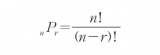
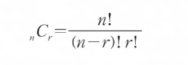
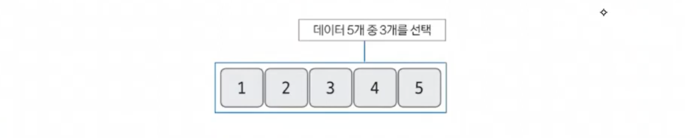
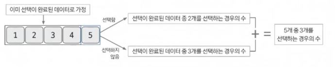

# 조합

## 인트로
- 요즘 코테 트렌드(2022)는 그래프, DP, 인덱스 트리가 빈출 유형이다.
- 그 중 DP를 이해하기 위한 기본 개념이 조합이다.
- 조합은 그 자체로도 코테에 자주 출제되는 주제이다.

## 조합 & 순열이란?
- 조합 : nCr (n개의 숫자에서 r개를 뽑는 경우의 수)
- 순열 : nPr (n개의 숫자 중 r개를 뽑아 순서롤 고려해 나열하는 경우의 수)
- 순열보다 조합이 출제 빈도수가 높고, 응용할 수 있는 문제가 많다.

## 조합 & 순열 이론 (수학적)

## 조합 (알고리즘 핵심 이론★) 💥👍🏻 

### 1. 특정 문제를 가정하기
- 5개의 데이터에서 3개를 선택하는 조합의 경우의 수를 푸는 문제라 가정
- 즉, 5C3

### 2. 모든 부분 문제가 해결된 상황이라 가정하고 지금 문제 생각하기 (★★★)

- 5C3 = 4C2 + 4C3
  - 5를 선택할 경우 = 앞 4개 중 2개를 선택한 경우 = 4C2
  - 5를 선택하지 않을 경우 = 앞 4개 중 3개를 선택한 경우 = 4C3
- 점화식으로 표현한다면 D[5][3] = D[4][3]+ E[4][2]

### 3. 특정 문제를 해결한 내용을 바탕으로 일반 점화식 도출하기
- D[i][j] = D[i-1][j] + D[i-1][j-1]
  - D[5][3] = D[4][3]+ E[4][2]
- 도출한 점화식으로 모든 경우 계산하면 됨.