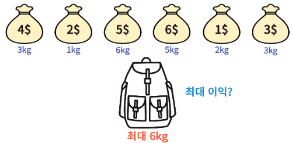
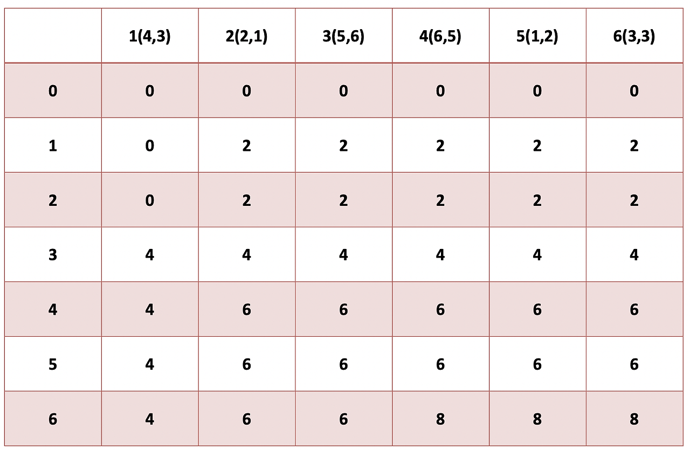

# 배낭문제

## 배낭문제?

### 배낭문제는 어떤 것이냐

- 배낭의 최대 용량을 초과하지 않으면서 배낭에 담을 수 있는 최대 가치의 합을 찾는 문제
- 즉, '높은 가치'와 '적은 무게'의 두 가지 기준에 맞추어 DP를 진행하는 것.
- 두 가지 조건 중 어떤 것을 선택해야 할지 정답이 없으므로 1차원 DP로는 풀기 불가!!!!!
- **2차원 DP로 풀어나갈 것.**
  

### 기본 점화식

1. 물건 K의 무게 > 배낭 W 무게

- dp [K][W] = **dp [K-1][W]**

2. 물건 K의 무게 <= 배낭 W 무게

- dp [K][W] = max(dp [K-1][W], **K가치 + dp [K-1][W-K무게]**)

### DP 탐색 결과 예시

